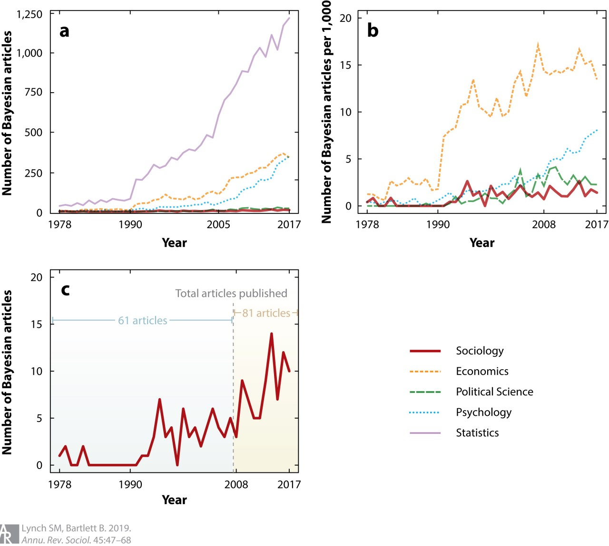

<style type="text/css">
slides > slide:not(.nobackground):after {
  content: '';
}
</style>

```{r setup, include=FALSE}
options(width = 90)
library(knitr)
library(rgl)
knit_hooks$set(rgl = hook_plot_custom)
knit_hooks$set(small.mar = function(before, options, envir) {
    if (before) par(mar = c(4, 4, .1, .1), las = 1)  # smaller margin on top and right
})
```

## Logistics I

* Class videos will be recorded and saved on NYUClasses
* Class participation is even more important in an online class
* Accept email invite to logon to https://campuswire.com/c/GB57F2ED0/
* One substantive question or answer per week constitutes "good" CampusWire participation
* Guidelines for using Zoom in this class:

    * If you have a question and want to interrupt Ben, type `Q` in the chat
    * If you have a question that can wait for Ben to pause, type `q` in the chat
    * Otherwise, limit conversations in the chat to brief questions that other students
      can answer like "What R package is the `foo` function in?"
    * If Ben asks a question, you can "raise hand" or indicate "yes / no" from the
      Participants window

## Logistics II

* There will be five minute breaks each hour
* Make sure you have the latest R and the RStudio preview release
* Office hours will be online, Tuesday afternoons or another time
* Will call on people randomly
* Clone or download course materials from https://github.com/bgoodri/NYU2020 
  and change your working directory to `Week1`
* Do the readings and watch McElreath's videos but those are BACKGROUND information
* Review the lecture notes after they are posted to GitHub
* Two or three homeworks plus a final project due in late May

## Obligatory Disclosure

* Ben is an employee of Columbia University, which has received several research grants to develop Stan
* Ben is also a manager of GG Statistics LLC, which uses Stan for business
* According to Columbia University 
  [policy](https://research.columbia.edu/content/conflict-interest-and-research), any such employee who 
  has any equity stake in, a title (such as officer or director) with, or is expected to earn at least 
  $\$5,000.00$ per year from a private company is required to disclose these facts in presentations

<div style="float: left; width: 60%;">
<video width="500" height="250" controls>
  <source src="https://video.twimg.com/ext_tw_video/999106109523742720/pu/vid/640x360/ljdUoEqXji0ES_CV.mp4?tag=3" type="video/mp4">
Your browser does not support the video tag.
</video> 
</div>
<div style="float: right; width: 40%;">
```{r, echo = FALSE, message = FALSE, fig.height=3, fig.width=4.5}
pp2 <- cranlogs::cran_downloads(package = "rstan", from = "2015-07-01", to = Sys.Date())
library(ggplot2)
ggplot(pp2,aes(x = date, y = count)) +
  geom_smooth(show.legend = FALSE, se = FALSE) +
  geom_hline(yintercept = 0) + 
  geom_vline(xintercept = as.numeric(as.Date("2018-05-20")), color = "red") +
  labs(x = 'Date', y = 'Daily downloads',
    title = 'RStan Daily Downloads from RStudio Mirror',
    caption = "Season 3, Episode 9 of Billions") +
  theme(plot.caption = element_text(color = "red", face = "italic"))
```
</div>

## Bayesian Articles (from [Lynch and Bartlett 2019](https://www.annualreviews.org/doi/abs/10.1146/annurev-soc-073018-022457))

<div style="float: left; width: 70%;">
```{r, echo = FALSE, fig.width=10, fig.height=5}

```
</div>
<div style="float: right; width: 30%;">
  > - Why the divergence in statistics after $1990$ compared to social sciences?
  > - Why more in economics than other social sciences?
  > - Why increasing in psychology in recent years?
  > - What is wrong with political science and sociology?
</div>

## Quotes from McElreath (2020, p.3)

> - "statistics is neither mathematics nor a science, but rather a branch of engineering"

> - "Advanced courses in statistics do emphasize engineering, but most scientists never get that far. Teaching statistics this way is like teaching engineering backwards, starting with bridge building and ending with basic physics."

> - "Serious trouble begins when scholars move on to conducting innovative research, pushing the boundaries of their specialties. It's as if we got our hydraulic engineers by promoting plumbers."

> - "Why aren’t the tests enough for innovative research? The classical procedures of introductory statistics tend to be inflexible and fragile. By inflexible, I mean that they have very limited ways to adapt to unique research contexts. By fragile, I mean that they fail in unpredictable ways when applied to new contexts."

## Aristotelian (Classical Propositional) Logic

1. All men are mortal
2. Socrates is a man
3. Ergo, Socrates is mortal
* There are 0 interesting applications of deductive logic in the social sciences
* The closest is perhaps democratic peace "theory":
    1. No two democracies fight a war against each other
    2. Australia and Germany are democracies
    3. Ergo, Australia and German will not fight a war against each other
* Whether (1) is true depends on how you operationalize "democracy" and "war" so
  the literature has descended into debates over things like whether a country
  is a democracy or whether a conflict they were involved in is a war
* A much better question is: Why are democracies much less likely to fight a war against
  each other compared to wars involving an autocracy?

## Five Sources of Uncertainty

1. Uncertainty about parameters in models
2. Uncertainty about which model is best
3. Uncertainty about what to do with the output of the (best) model(s)
4. Uncertainty about whether the software works as intended
5. Uncertainty about whether the (best) model(s) hold with other data

* Bayesians use probability to describe their uncertainty in (1) and (2)
* The Bayesian approach links with decision theory, which prescribes (3)
* The Stan software does as much as we can to mitigate (4)
* By implication, other approaches / software may refer to probability
  but fail to handle one or more of the above five items
* These include  randomization inference, Frequentist inference, supervised 
  learning, and others

## Sets and Sample Space

- A set is a collection of intervals and / or isolated elements
- One often-used set is the set of real numbers, $\mathbb{R}$
- Often negative numbers are excluded from a set; e.g. $\mathbb{R}_{+}$
- Integers are a subset of $\mathbb{R}$, denoted $\mathbb{Z}$, where
the decimal places are $.000\dots$.

> - The sample space, denoted $\Omega$, is the set of all possible outcomes of an observable random variable

> - Suppose you roll a six-sided die. What is $\Omega$?
> - Do not conflate a REALIZATION of a random variable with the FUNCTION that generated it
> - By convention, a capital letter, $X$, indicates a random variable
and its lower-case counterpart, $x$, indicates a realization of $X$

## A Frame of Bowling

Each frame in bowling starts with $n=10$ pins & you get up to 2 rolls per frame
```{r, echo = FALSE}
vembedr::embed_url("https://youtu.be/HeiNrSllyzA?t=05")
```

## Approaching Bowling Probabilistically

> - What is $\Omega$ for your first roll of a frame of bowling?
> - [Hohn (2009)](https://digitalcommons.wku.edu/cgi/viewcontent.cgi?article=1084&context=theses) 
  discusses a few distributions for the probability of knocking down $X\geq 0$ out of $n\geq X$ pins, including $\Pr\left(\left.x\right|n\right)=\frac{\mathcal{F}\left(x\right)}{-1 + \mathcal{F}\left(n+2\right)}$
where $\mathcal{F}\left(x\right)$ is the $x$-th Fibonacci number, i.e. $\mathcal{F}\left(0\right)=1$,
$\mathcal{F}\left(1\right)=1$, and otherwise $\mathcal{F}\left(x\right)=\mathcal{F}\left(x-1\right)+\mathcal{F}\left(x-2\right)$. The $\mid$ is
  read as "given".
> - First 13 Fibonacci numbers are 1, 1, 2, 3, 5, 8, 13, 21, 34, 55, 89, 144, and 233
> - Sum of the first 11 Fibonacci numbers is 232

## `source("bowling.R")` for this Code Chunk {.build}

```{r, FandPr}
# computes the x-th Fibonacci number without recursion and with vectorization
F <- function(x) {
  sqrt_5 <- sqrt(5)
  golden_ratio <- 0.5 * (1 + sqrt_5)
  return(round(golden_ratio ^ (x + 1) / sqrt_5))
}
# probability of knocking down x out of n pins
Pr <- function(x, n = 10) return( ifelse(x > n, 0, F(x)) / (-1 + F(n + 2)) )

Omega <- 0:10 # 0, 1, 2, 3, 4, 5, 6, 7, 8, 9, 10
names(Omega) <- as.character(Omega)
round(c(Pr(Omega), total = sum(Pr(Omega))), digits = 4)

x <- sample(Omega, size = 1, prob = Pr(Omega)) # realization of random variable
```

## Second Roll in a Frame of Bowling

> - How would you compute the probability of knocking down all the remaining pins on 
  your second roll?
> - Let $X_{1}$ and $X_{2}$ respectively be the number of pins knocked down on 
  the first and second rolls of a frame of bowling. What function yields the
  probability of knocking down $x_2$ pins on your second roll?

> - $\Pr\left(\left.x_{2}\right|n = 10 - x_1\right)=\frac{\mathcal{F}\left(x_{2}\right)}{-1 + \mathcal{F}\left(10-x_{1}+2\right)}\times\mathbb{I}\left\{ x_{2}\leq10-x_{1}\right\}$
> - $\mathbb{I}\left\{ \cdot\right\}$ is an "indicator function" that equals $1$ if it is true and $0$ if it is false
> - $\Pr\left(\left.x_{2}\right|n = 10 - x_1\right)$ is a CONDITIONAL probability that depends on the
  realization of $x_1$

## From [Aristotelian Logic](https://en.wikipedia.org/wiki/Boolean_algebra) to Bivariate Probability

- In R, `TRUE` maps to $1$ and `FALSE` maps to $0$ when doing arithmetic operations
```{r, AND}
c(TRUE * TRUE, TRUE * FALSE, FALSE * FALSE)
```
- Can generalize to probabilities on the $[0,1]$ interval to compute the probability
  that two (or more) propositions are true simultaneously
- $\bigcap$ reads as "and". __General Multiplication Rule__: $\Pr\left(A\bigcap B\right)=\Pr\left(B\right)\times\Pr\left(\left.A\right|B\right)=\Pr\left(A\right)\times\Pr\left(\left.B\right|A\right)$

## Breakout Rooms

Work together to answer questions E1 and E2 from McElreath page 46
  
## Independence

- Loosely, $A$ and $B$ are independent propositions if $A$ being true or false tells
  us nothing about the probability that $B$ is true (and vice versa)
- Formally, $A$ and $B$ are independent iff $\Pr\left(\left.A\right|B\right)=\Pr\left(A\right)$
  (and $\Pr\left(\left.B\right|A\right)=\Pr\left(B\right)$). Thus, 
  $\Pr\left(A\bigcap B\right)=\Pr\left(A\right)\times\Pr\left(B\right)$.
- Why is it reasonable to think
    - Two rolls in the same frame are not independent?
    - Two rolls in different frames are independent?
    - Rolls by two different people are independent regardless of whether they are in the same frame?

> - What is the probability of obtaining a turkey (3 consecutive strikes)?
> - What is the probability of knocking down $9$ pins on the first roll and $1$ pin 
  on the second roll?
  
## Joint Probability of Two Rolls in Bowling

- How to obtain the joint probability, $\Pr\left(\left.x_{1}\bigcap x_{2}\right|n=10\right)$, in general?

$$\begin{eqnarray*}
\Pr\left(\left.x_{1}\bigcap x_{2}\right|n=10\right) & = & \Pr\left(\left.x_{1}\right|n=10\right)\times\Pr\left(\left.x_{2}\right|n = 10 - x_1\right)\\
 & = & \frac{\mathcal{F}\left(x_{1}\right) \times \mathcal{F}\left(x_{2}\right) \times \mathbb{I}\left\{ x_{2}\leq10-x_{1}\right\}}{\left(-1+\mathcal{F}\left(10+2\right)\right)\times
 \left(-1 + \mathcal{F}\left(10-x_{1}+2\right)\right)}
\end{eqnarray*}$$

```{r, joint}
joint_Pr <- matrix(0, nrow = length(Omega), ncol = length(Omega))
rownames(joint_Pr) <- colnames(joint_Pr) <- as.character(Omega)
for (x1 in Omega) { # already created by source("bowling.R")
  Pr_x1 <- Pr(x1, n = 10)
  for (x2 in 0:(10 - x1))
    joint_Pr[x1 + 1, x2 + 1] <- Pr_x1 * Pr(x2, n = 10 - x1)
}
sum(joint_Pr) # that sums to 1
```

## `joint_Pr`: row index is roll 1; column is roll 2 {.smaller}

```{r, size='footnotesize', echo = FALSE, message = FALSE}
library(kableExtra)
library(dplyr)
options("kableExtra.html.bsTable" = TRUE)
options(scipen = 5)
tmp <- as.data.frame(joint_Pr)
for (i in 1:ncol(tmp)) 
  tmp[,i] <- cell_spec(round(tmp[,i], digits = 6), "html", bold = tmp[,i] == 0,
                       color = ifelse(tmp[,i] == 0, "red", "black"))
kable(tmp, digits = 5, align = 'c', escape = FALSE) %>%
    kable_styling("striped", full_width = FALSE)
```

## Aristotelian Logic to Probability of Alternatives

```{r, OR}
c(TRUE + FALSE, FALSE + FALSE)
```

- What is the probability that between this frame and the next one, you do not get two strikes?

> - Can generalize Aristotelian logic to probabilities on the $[0,1]$ interval to compute the probability
  that one of two (or more) propositions is true
> - $\bigcup$ is read as "or". __General Addition Rule__: $\Pr\left(A\bigcup B\right)=\Pr\left(A\right)+\Pr\left(B\right)-\Pr\left(A\bigcap B\right)$
> - If $\Pr\left(A\bigcap B\right) = 0$, $A$ and $B$ are mutually exclusive (disjoint)
> - What is the probability of knocking down 9 pins on the second roll irrespective of the first roll?

## Marginal Distribution of Second Roll in Bowling

- How to obtain $\Pr\left(x_{2}\right)$ irrespective of $x_{1}$?
- Since events in the first roll are mutually exclusive, use the simplified
form of the General Addition Rule to "marginalize":
$$\begin{eqnarray*}
\Pr\left(x_{2}\right) & = & 
\sum_{x = 0}^{10}\Pr\left(\left.X_1 = x\bigcap X_2 = x_{2}\right|n=10\right)\\
 & = & \sum_{x = 0}^{10}
 \Pr\left(\left.x\right|n=10\right) \times \Pr\left(\left.x_{2}\right|n = 10 - x\right)
\end{eqnarray*}$$
```{r, marginal, size='footnotesize', comment=NA}
round(rbind(Pr_X1 = Pr(Omega), margin1 = rowSums(joint_Pr), margin2 = colSums(joint_Pr)), 4)
```


## Marginal, Conditional, and Joint Probabilities

> - To compose a joint (in this case bivariate) probability, MULTIPLY a marginal probability by
  a conditional probability
> - To decompose a joint (in this case bivariate) probability, ADD the relevant joint probabilities
  to obtain a marginal probability
> - To obtain a conditional probability, DIVIDE the joint probability by the marginal probability 
  of the event that you want to condition on because
$$\Pr\left(A\bigcap B\right)=\Pr\left(B\right)\times\Pr\left(\left.A\right|B\right)=\Pr\left(A\right)\times\Pr\left(\left.B\right|A\right) \implies$$
$$\Pr\left(\left.A\right|B\right)= \frac{\Pr\left(A\right)\times\Pr\left(\left.B\right|A\right)}{\Pr\left(B\right)} \mbox{ if } \Pr\left(B\right) > 0$$
> - This is Bayes' Rule  
> - What is an expression for $\Pr\left(\left.X_1 = 3\right|X_2 = 4\right)$ in bowling?

## Conditioning on $X_2 = 4$ in Bowling {.smaller}

```{r, size='footnotesize', echo = FALSE}
tmp <- as.data.frame(joint_Pr)
for (i in 1:ncol(tmp)) 
  tmp[,i] <- cell_spec(round(tmp[,i], digits = 6), "html", bold = tmp[,i] == 0,
                       color = ifelse(tmp[,i] == 0, "red", 
                                      ifelse(i == 5, "black", "blue")))
kable(tmp, digits = 5, align = 'c', escape = FALSE) %>%
    kable_styling("striped", full_width = FALSE)
```

## Example of Bayes' Rule

```{r}
joint_Pr["3", "4"] / sum(joint_Pr[ , "4"])
```
- Bayesians generalize this by taking $A$ to be "beliefs about whatever you do not know" and 
  $B$ to be whatever you do know in 
$$\Pr\left(\left.A\right|B\right)= \frac{\Pr\left(A\right) \times \Pr\left(\left.B\right|A\right)}{\Pr\left(B\right)}
\mbox{ if } \Pr\left(B\right) > 0$$
- Frequentists accept the validity Bayes' Rule but object to using the language of probability to describe 
  beliefs about unknown propositions and insist that probability is a property of a process 
  that can be defined as a limit
$$\Pr\left(A\right) = \lim_{S\uparrow\infty} 
\frac{\mbox{times that } A \mbox{ occurs in } S \mbox{ independent randomizations}}{S}$$

## $\Pr\left(x_1 \mid x_2\right)$: row index is roll 1; column is roll 2 {.smaller}

```{r, size='footnotesize', echo = FALSE, message = FALSE}
library(kableExtra)
library(dplyr)
options("kableExtra.html.bsTable" = TRUE)
options(scipen = 5)
tmp <- as.data.frame(sweep(joint_Pr, MARGIN = 2, STATS = colSums(joint_Pr), FUN = `/`))
for (i in 1:ncol(tmp)) 
  tmp[,i] <- cell_spec(round(tmp[,i], digits = 6), "html", bold = tmp[,i] == 0,
                       color = ifelse(tmp[,i] == 0, "red", "purple"))
kable(tmp, digits = 5, align = 'c', escape = FALSE) %>%
    kable_styling("striped", full_width = FALSE)
```

## Probability that a Huge Odd Integer is Prime

> - John Cook [asks](https://www.johndcook.com/blog/2010/10/06/probability-a-number-is-prime/)
  an interesting question: What is the probability $x$ is prime, where $x$ is a huge, odd integer
  like $1 + 10^{100000000}$?
    
> - To Frequentists, $x$ is not a random variable. It is either prime or composite and it makes no
  sense to say that it is "probably (not) prime"
> - To Bayesians, $x$ is either prime or composite but no one knows for sure whether it is prime.
  But the probability that $x$ is prime goes up each time you divide it by a prime number
  and find that it has a non-zero remainder
> - The prime number theorem implies provides a way to choose the prior probability that
  $x$ is prime based on its number of digits $\left(d\right)$
$$\Pr\left(x \mbox{ is prime}\right) = \frac{1}{d \ln 10} \approx \frac{4}{10^{10}}$$
  although you could double that merely by taking into account that $x$ is odd

## Breakout Rooms

Work together to answer questions E4 from McElreath page 46

## A Very, Very Frequentist Example

>- Suppose you plan to collect $N$ iid observations on a count outcome $\left(Y\right)$ 
  that are generated according to a Poisson distribution with expectation $\mu$
>- What probability distribution does the the sample mean follow?
>- Let $S = \sum_{n = 1}^N y_n$ and $\overline{y} = \frac{S}{N}$. The probability that $Y$ 
takes the value $y$ is 
$$\Pr\left(Y = y \mid \mu\right) = \frac{\mu^y e^{-\mu}}{y!}$$
>- The probability of observing the entire sample of size $N$ is
$$\Pr\left(y_1, y_2, \dots y_N \mid \mu\right) = 
  \prod_{n = 1}^N \frac{\mu^{y_n} e^{-\mu}}{y_n!} = 
  e^{-N \mu} \frac{\mu^{\sum_{n = 1}^N y_n}}{\prod_{n = 1}^N y_n!} = 
  \frac{\mu^S e^{-N \mu}}{?}$$
>- ? must be $S!$ to make this a PMF, namely Poisson with expectation $N\mu$

## A Special Case of the Central Limit Theorem

>- If $S$ is distributed Poisson with expectation $N\mu$, then $\overline{y} = \frac{S}{N}$ has expectation $\mu$
  and $\overline{y} = \frac{S}{N}$ has variance $\frac{N\mu}{N^2} = \frac{\mu}{N}$
>- As $N \uparrow \infty$, then the skewness of $S$, which is $\frac{1}{\sqrt{N \mu}}$, approaches $0$ and
  the excess kurtosis of $S$, which is $\frac{1}{N \mu}$, approaches $0$
>- Therefore, $\overline{y} = \frac{S}{N}$ has no skewness or excess kurtosis as $N \uparrow \infty$
>- The normal is the only distribution with no skewness or excess kurtosis
>- Thus, as $N \uparrow \infty$, $\overline{y} = \frac{S}{N}$ is distributed 
  normal with expectation $\mu$ and standard deviation $\sqrt{\frac{\mu}{N}}$
>- And as $N \uparrow \infty$, $\frac{\overline{y} - \mu}{\sqrt{\frac{\mu}{N}}}$ is
  distributed standard normal

## Frequentist Perspective on Probability

- Probability is necessitated by deliberate randomization, such as sampling from a population
- Probability of $X$ is interpreted as the proportion of times $X$ happens in the
  limit as the number of random trials approaches infinity
- The probability statements pertain to estimators (or functions thereof)
- Sample mean is distributed normally across datasets (iff variance exists)
- Maximum likelihood estimates are distributed normally across datasets (under some assumptions)
- The probability statements are always pre-data
- The probability statements are conditional on the parameters being estimated

>- What use is this Frequentist perspective on probability for applied research?

## Quotes from McElreath (2020, p.4&10)

- "The greatest obstacle that I encounter among students and colleagues is the tacit belief that the proper objective of statistical inference is to test null hypotheses"
    - Hypotheses are not models
    - Measurement error prevents deductive falsification
- "what researchers need is ... a set of principles for designing, building, and refining special-purpose statistical procedures. Every major branch of statistical philosophy possesses such a unified theory. But the theory is never taught in introductory ... courses. So there are benefits in rethinking statistical inference as a set of strategies, instead of a set of pre-made tools."

1. Bayesian data analysis 
2. Multilevel models
3. Model comparison using information criteria
4. Graphical Causal Models / Directed Acyclic Graphs

## Probability and Cumulative Mass Functions

- $\Pr\left(\left.x\right|\boldsymbol{\theta}\right)$ is a Probability Mass Function (PMF) 
over a discrete $\Omega$ that may depend on some parameter(s) $\boldsymbol{\theta}$ and the 
Cumulative Mass Function (CMF) is 
$\Pr\left(\left.X\leq x\right|\boldsymbol{\theta}\right)=\sum\limits_{i = \min\{\Omega\}}^x \Pr\left(\left.i\right|\boldsymbol{\theta}\right)$
- In our model for bowling without parameters, 
$\Pr\left(X\leq x\right) = \frac{ -1 + \mathcal{F}\left(x+2\right)}{- 1 + \mathcal{F}\left(n+2\right)}$
```{r}
CMF <- function(x, n = 10) return( (-1 + F(x + 2)) / (-1 + F(n + 2)) )
round(CMF(Omega), digits = 5)
```
- How do we know this CMF corresponds to our PMF 
$\Pr\left(\left.x\right|n\right) = \frac{\mathcal{F}\left(x\right)}{- 1 + \mathcal{F}\left(n+2\right)}$?

## PMF is the Rate of Change in the CMF

```{r, echo=FALSE, fig.height=6,fig.width=9}
par(mar = c(5,4,0.5,0.5) + .1, las = 1)
cols <- rainbow(11)
x <- barplot(CMF(Omega), xlab = "Number of pins", ylab = "Probability of knocking down at most x pins", 
             col = cols, density = 0, border = TRUE)[,1]
for(i in 0:9) {
  j <- i + 1L
  points(x[j], CMF(i), col = cols[j], pch = 20)
  segments(x[j], CMF(i), x[j + 1L], CMF(j), col = cols[j], lty = 2)
}
abline(h = 1, lty = "dotted")
points(x[11], 1, col = cols[11], pch = 20)
```

## Cumulative Density Functions {.build}

> - Now $\Omega$ is an interval; e.g. $\Omega=\mathbb{R}$, $\Omega=\mathbb{R}_{+}$,
$\Omega=\left(a,b\right)$, etc.
> - $\Omega$ has an infinite number of points with zero width, so $\Pr\left(X = x\right) \downarrow 0$
> - $\Pr\left(X\leq x\right)$ is called the Cumulative Density Function (CDF) from $\Omega$ to 
$\left[0,1\right]$
> - No conceptual difference between a CMF and a CDF except emphasis on
whether $\Omega$ is discrete or continuous so we use 
$F\left(\left.x\right|\boldsymbol{\theta}\right)$ for both
```{r, echo = FALSE, fig.height=3, fig.width=9, small.mar = TRUE}
curve(x + log1p(-x) * (1 - x), from = 0, to = 1, n = 1001, ylab = "Cumulative Density", ylim = c(0, 1))
legend("topleft", legend = "x + ln(1 - x) (1 - x)", lty = 1, col = 1, bg = "lightgrey", box.lwd = NA)
```

## From CDF to a Probability Density Function (PDF)

- Previous CDF over $\Omega = \left[0,1\right]$ was 
  $F\left(x\right) = x + \ln\left(1 - x\right) \times \left(1 - x\right)$

> - $\Pr\left(a<X\leq x\right)=F\left(x \mid \boldsymbol{\theta}\right)-F\left(a \mid \boldsymbol{\theta}\right)$
as in the discrete case
> - If $x=a+h$, $\frac{F\left(x \mid \boldsymbol{\theta}\right)-F\left(a \mid \boldsymbol{\theta}\right)}{x-a}=\frac{F\left(a+h \mid \boldsymbol{\theta}\right)-F\left(a \mid \boldsymbol{\theta}\right)}{h}$ is the slope of a line segment
> - If we then let $h\downarrow0$, $\frac{F\left(a+h \mid \boldsymbol{\theta}\right)-F\left(a \mid \boldsymbol{\theta}\right)}{h}\rightarrow\frac{\partial F\left(a \mid \boldsymbol{\theta}\right)}{\partial a}\equiv f\left(x \mid \boldsymbol{\theta}\right)$
is still the RATE OF CHANGE in $F\left(x \mid \boldsymbol{\theta}\right)$ at $x$
> - The derivative of $F\left(x\right)$ with respect to $x$ is the Probability
Density Function (PDF) & denoted $f\left(x\right)$, which is always positive because the CDF increases
> - $f\left(x\right)$ is NOT a probability (it is a probability's slope) but is used like a PMF
> - What is slope of $F\left(x\right) = x + \ln\left(1 - x\right) \times \left(1 - x\right)$ at $x$?
> - [Answer](https://www.wolframalpha.com/input/?i=partial+derivative):
  $\frac{\partial}{\partial x}F\left(x\right) = 
  1 - 1 \times \ln\left(1 - x\right) - \frac{1 - x}{1 - x} = -\ln\left(1 - x\right) \geq 0$

## Expectations of Functions of Random Variables

- Let $g\left(X\right)$ be a function of $X \in \Omega$
- The expectation of $g\left(X\right)$, if it exists (which it may not), is defined as

    * Discrete $\Omega$: $\mathbb{E}g\left(X\right) = \sum_{x = \min \Omega}^{\max \Omega} 
      g\left(x\right) f\left(x\right)$
    * Continuous $\Omega$: $\mathbb{E}g\left(X\right) = 
\int_{\min \Omega}^{\max \Omega} 
g\left(x\right)f\left(x\right)dx$
    * In general: $\mathbb{E}g\left(X\right) = \lim_{S \uparrow \infty} \frac{1}{S} \sum_{s = 1}^S
      g\left(\widetilde{x}_s\right)$, where $\widetilde{x}_s$ is the $s$-th random draw from distribution
      whose P{M,D}F is $f\left(x\right)$

> - If $g\left(X\right)=X$, $\mathbb{E}X=\mu$ is "the" expectation 
> - If $g\left(X\right)=\left(X-\mu\right)^{2}$, 
  $\mathbb{E}g\left(X\right) = \mathbb{E}\left[X^2\right] - \mu^2 = \sigma^{2}$ is the variance of $X$

## A Very, Very Bayesian Example

>- Taking limits, we can express Bayes' Rule for continuous random variables with Probability
  Density Functions (PDFs)
$$f\left(B\mid A\right) = \frac{f\left(B\right) f\left(A \mid B\right)}{f\left(A\right)}$$
>- The PDF of the Gamma distribution (shape-rate parameterization) is
$$\color{red}{f\left(\left.\mu\right|a,b\right) = \frac{b^a}{\Gamma\left(a\right)} \mu^{a - 1} e^{-b \mu}}$$
>- Poisson PMF for $N$ observations is again 
$\color{blue}{f\left(\left.y_1,\dots,y_n\right|\mu\right) =  \frac{\mu^{S} e^{-N\mu}}{S!}}$
>- Bayes' Rule is
$\color{purple}{f\left(\left.\mu\right|a,b,y_1,\dots,y_n\right) = }
\frac{\color{red}{\mu^{a - 1} e^{-b \mu}} \color{blue}{\mu^{S} e^{-N\mu}}}{?} = 
\frac{\color{purple}{\mu^{a + S - 1} e^{-\left(b + N\right) \mu}}}{?}$
>- ? must be $\color{purple}{\frac{\Gamma\left(a^\ast\right)}{\left(b^\ast\right)^{a^\ast}}}$ where
  $a^\ast = a + S$ and $b^\ast = b + N$ so posterior is Gamma

## Bayesian Perspective on Probability

* Probability is necessitated by incomplete information and used to describe
  your degree of belief that something is true
- The probability statements pertain to beliefs about unknowns
- The probability statements are conditional on the data actually observed
* You have beliefs about how much the S&P500 will grow by the end of $2020$
* You express your beliefs with a probability distribution, such as a normal
  distribution with a mean of $-10\%$ and a standard deviation of $5\%$
* As more data comes during $2020$, you update your beliefs about
  where the S&P500 will be at the end of $2020$ to some new probability distribution
* Note the data are not, and need not be, a sample or an experiment for you to
  use probability distributions to describe your beliefs in a rigorous way 


## (Dis)Advantages of Bayesian Inference

- Bayesian inference remains useful in situations other paradigms specialize:
    - Experiments: What are your beliefs about the ATE after seeing the data?
    - Repeated designs: Bayesian estimates have correct frequentist properties
    - Predictive modeling: If you only care about predictions, use the 
      posterior predictive distribution
- Bayesian inference is very useful when you are using the results to make a decision
  or take an action; other paradigms are not
- Bayesian inference is orders of magnitude more difficult for your computer because
  it is attempting to answer a more ambitious question
- The Bayesian approach is better suited for convincing yourself of something than
  convincing other people

## Difficulty of Analytical Bayesian Inference

- Bayes Rule for an unknown parameter (vector) $\boldsymbol{\theta}$ conditional on known
data (vector) $\mathbf{y}$ can be written as
$$f\left(\boldsymbol{\theta} \mid \mathbf{y}\right) = 
\frac{f\left(\boldsymbol{\theta}\right) f\left(\mathbf{y} \mid \boldsymbol{\theta}\right)}
{f\left(\mathbf{y}\right)} = 
\frac{f\left(\boldsymbol{\theta}\right) f\left(\mathbf{y} \mid \boldsymbol{\theta}\right)}
{\int_{-\infty}^\infty \int_{-\infty}^\infty \dots \int_{-\infty}^\infty 
f\left(\boldsymbol{\theta}\right) f\left(\mathbf{y} \mid \boldsymbol{\theta}\right)
d\theta_1 d\theta_2 \dots d\theta_K}$$

>- To obtain the denominator of Bayes Rule, you would need to do an integral
>- The [Risch Algorithm](https://en.wikipedia.org/wiki/Risch_algorithm) tells you if
  an integral has an elementary form (rare)
>- In most cases, we can't write the denominator of Bayes Rule in a useful form
>- But we can draw from a distribution whose PDF is characterized by the numerator of
  Bayes Rule without knowing the denominator

