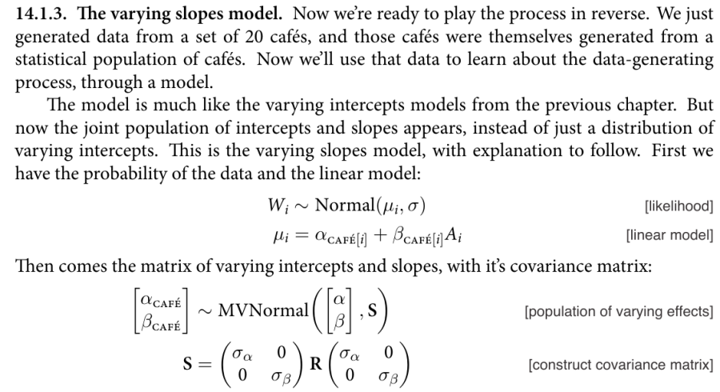

<style type="text/css">
slides > slide:not(.nobackground):after {
  content: '';
}
</style>

```{r setup, include=FALSE}
options(width = 90)
library(knitr)
library(rgl)
knit_hooks$set(rgl = hook_plot_custom)
knit_hooks$set(small.mar = function(before, options, envir) {
    if (before) par(mar = c(4, 4, .1, .1), las = 1)  # smaller margin on top and right
})
hook_output <- knit_hooks$get("output")
knit_hooks$set(output = function(x, options) {
  lines <- options$output.lines
  if (is.null(lines)) {
    return(hook_output(x, options))  # pass to default hook
  }
  x <- unlist(strsplit(x, "\n"))
  more <- "..."
  if (length(lines)==1) {        # first n lines
    if (length(x) > lines) {
      # truncate the output, but add ....
      x <- c(head(x, lines), more)
    }
  } else {
    x <- c(more, x[lines], more)
  }
  # paste these lines together
  x <- paste(c(x, ""), collapse = "\n")
  hook_output(x, options)
})
library(rstanarm)
options(mc.cores = parallel::detectCores())
```

## Final Projects

- Due by 11:59 PM on May 19th
- Can analyze data used in another class
- If you cannot share the data, let me know
- Can use rstanarm or brms or write your own Stan code (next week)
- I don't care very much what the previous literature says
- Go through the process of laying out a generative model, drawing from the prior
  predictive distribution, conditioning on the observed data (and making
  sure Stan samples well), looking at posterior predictive plots, comparing it
  to an alternative model, etc.
- Should be around ten pages as a PDF

## `GLD_solver_LBFGS` in GLD_helpers.R

* Week2/GLD_helpers.R now has a `GLD_solver_LBFGS` function
```{r}
source(file.path("..", "Week2", "GLD_helpers.R"))
args(GLD_solver_LBFGS)
```
are the same as `GLD_solver`

* The `GLD_solver_LBFGS` function throws warnings rather than errors when
  it cannot find an exact solution for the asymmetry and steepness parameters
```{r}
rstan::expose_stan_functions(file.path("..", "Week2", "quantile_functions.stan"))
a_s <- GLD_solver_LBFGS(lower_quartile = 3, median = 5, upper_quartile = 8,
                        other_quantile = 1200, alpha = 0.9) # warnings
```

## What Are Hierarchical Models

* In Bayesian terms, a hierarchical model is nothing more than a model where the prior distribution
  of some parameter depends on another parameter
* In other words, it is just another application of the Multiplication Rule
$$f\left(\boldsymbol{\theta}\right) = \int f\left(\boldsymbol{\theta} \mid \boldsymbol{\phi}\right)
  f\left(\boldsymbol{\phi}\right) d\phi_1 \dots d\phi_K$$
* But most of the discussion of "hierarchical models" refers to the very narrow circumstances
  in which they can be estimated via frequentist methods
* From a frequentist perspective, a hierarchical model is appropriate for 
  cluster random sampling designs, inappropriate for stratified random
  sample designs, and hard to justify for other sampling designs

## Breakout Rooms

Suppose the coefficient on age is a linear function of the income of the person's zip code 
in a logit model for whether they vote, in the Oregon Medicaid experiment dataset from the
homework. Draw from the prior predictive distribution in R using `replicate`. You can ignore 
the other predictors.

## Cluster Sampling vs. Stratified Sampling

* For cluster random sampling, you

  * Sample $J$ large units (such as schools) from their population
  * Sample $N_j$ small units (such as students) from the $j$-th large unit

* If you replicate such a study, you get different realizations of the large units
* For stratified random sampling, you

  * Divide the population of large units into $J$ mutually exclusive and exhaustive groups (like states)
  * Sample $N_j$ small units (such as voters) from the $j$-th large unit

* If you replicate such a study, you would use the same large units and only
  get different realizations of the small units

## Why Bayesians Should Use Hierarchical Models

* Suppose you estimated a Bayesian model on people in New York
* Next, you are going to collect data on people who live in Connecticut
* Intuitively, the New York posterior should influence the Connecticut prior
* But it is unlikely that the data-generating processes in Connecticut is exactly the
  same as in New York
* Hierarchical models apply when you have data from New York, Connecticut, and other
  states at the same time
* Posterior distribution in any one state is not independent of other states
* Posterior distribution in any one state are not the same as in other states
* McElreath argues hierarchical models should be the default and "flat" models
  should be the rare exception only when justified by the data
* With more data, there is always more heterogeneity in the data-generating processes
  that a generative model should be allowing for

## Models with Group-Specific Intercepts

- Let $\alpha$ be the common intercept and $\boldsymbol{\beta}$ be the common coefficients while
  $a_j$ is the deviation from the common intercept in the $j$-th group. Write a model as:
$$y_{ij} = \overbrace{\underbrace{\alpha + \sum_{k = 1}^K \beta_k x_{ik}}_{\mbox{Frequentist }
\boldsymbol{\mu} \mid \mathbf{x}}+a_j}^{\mbox{Bayesian } \boldsymbol{\mu} \mid \mathbf{x},j} +\boldsymbol{\epsilon} = \alpha + \sum_{k = 1}^K \beta_k x_{ik}+\underbrace{a_j + \overbrace{\boldsymbol{\epsilon}}^{\mbox{Bayesian error}}}_{\mbox{Frequentist error}}$$
- The same holds in GLMs where $\eta_{ij} = \alpha + \sum_{k = 1}^K \beta_k x_{ik} + a_j$ 
  or $\eta_{ij} = \alpha + \sum_{k = 1}^K \beta_k x_{ik}$ depending on whether you are
  Bayesian or Frequentist
  
## Models with Group-Specific Slopes and Intercepts
  
- Let $\alpha$ be the common intercept and $\boldsymbol{\beta}$ be the common coefficients while
  $a_j$ is the deviation from the common intercept in the $j$-th group and $\mathbf{b}_j$ is
  the deviation from the common coefficients. Write the model as:
$$y_{ij} = \overbrace{\underbrace{\alpha + \sum_{k = 1}^K \beta_k x_{ik}}_{\mbox{Frequentist }
\boldsymbol{\mu} \mid \mathbf{x}} + a_j + \sum_{k = 1}^K b_{jk} x_{ik}}^{\mbox{Bayesian } \boldsymbol{\mu} \mid \mathbf{x},j} +\boldsymbol{\epsilon} = \\ \alpha + \sum_{k = 1}^K \beta_k x_{ik}+\underbrace{a_j + \sum_{k = 1}^K b_{jk} x_{ik} + \overbrace{\boldsymbol{\epsilon}}^{\mbox{Bayesian error}}}_{\mbox{Frequentist error}}$$
- And similarly for GLMs

## Frequentist Estimation of Multilevel Models

- Frequentists assume that $a_j$ and $b_j$ deviate from the common parameters according
  to a (multivariate) normal distribution, whose (co)variances are common parameters
  to be estimated
- To Frequentists, $a_j$ and $b_j$ are not parameters because parameters must remained
  fixed in repeated sampling of observations from some population
- Since $a_j$ and $b_j$ are not parameters, they can't be "estimated" only "predicted"
- Since $a_j$ and $b_j$ aren't estimated, they must be integrated out of
  the likelihood function, leaving an integrated likelihood function of the common
  parameters
- After obtaining maximum likelihood estimates of the common parameters, each
  $a_j$ and $b_j$ can be predicted from the residuals via a regression
- Estimated standard errors produced by frequentist software are too small
- There are no standard errors etc. for the $a_j$ and $b_j$
- Maximum likelihood estimation often results in a corner solution

## Table 2 from the **lme4** [Vignette](https://www.jstatsoft.org/article/view/v067i01/0) (see also the [FAQ](https://bbolker.github.io/mixedmodels-misc/glmmFAQ.html#model-specification))


## Hierarchical Models in Psychology

- In political science and economics, the "big" units are often countries or sub-national
  political areas like states and the "small" units are people
- In [psychology](https://arxiv.org/pdf/1506.04967.pdf), the "big" units are often people and 
  the "small" units are questions or outcomes on repeated tasks
- Hierarchical model syntax is like
```{r, eval = FALSE}
y ~ x + (x | person) + (1 | question)
```

> - Question of interest is how to predict `y` for a new "big" unit (person)

## Hierarchical Models in **rstanarm** (from this [paper](http://www.tqmp.org/RegularArticles/vol14-2/p099/p099.pdf))

```{r, message = FALSE}
dat <- read.csv("https://osf.io/5cg32/download")
library(rstanarm)
```

```{r, psych, cache = TRUE, results = "hide", warning = FALSE}
post <-  stan_glmer(valence ~ arousal + (1 + arousal | PID), data = dat,
                    prior = normal(0, 1, autoscale = FALSE), 
                    prior_intercept = normal(50, 100, autoscale = FALSE))
```
<div class="columns-2">
```{r, output.lines = (6:20), warning = FALSE}
post
```
</div>

## Accessor Functions (based on the **lme4** package)

```{r}
fixef(post)
cbind(b = head(ranef(post)$PID), total = head(coef(post)$PID))
dim(as.matrix(post)) # 4000 x 46
```

## Posterior Predictive Checks

```{r, fig.width=10, fig.height=5}
pp_check(post, plotfun = "ribbon_grouped", x = dat$arousal, group = dat$PID)
```

## Frequentist Example

```{r, message = FALSE, warning = FALSE}
poll <- readRDS("GooglePoll.rds") # WantToWin is coded as 1 for Romney and 0 for Obama
poll$Income[poll$Income == "150,000+"] <- "100,000-149,999"
library(dplyr)
collapsed <- filter(poll, !is.na(WantToWin)) %>%
             group_by(Region, Gender, Urban_Density, Age, Income) %>%
             summarize(Romney = sum(grepl("Romney", WantToWin)), Obama = n() - Romney) %>%
             na.omit
```
```{r, glmer, cache = TRUE, results = "hide", warning = FALSE}
lme4::glmer(cbind(Romney, Obama) ~ Gender + Urban_Density + Age + Income +
              (Gender + Urban_Density + Age + Income | Region),
            data = collapsed, family = binomial(link = "logit"))
```

> - For models that are more complicated than `(1 + x | g)`, the MLE of $\boldsymbol{\Sigma}$ 
  usually implies that $\widehat{\boldsymbol{\Sigma}}^{-1}$ does not exist

## Bayesian Version of the "Same" Model {.smaller}

```{r, post_h, cache = TRUE, results = "hide"}
post_h <- stan_glmer(cbind(Romney, Obama) ~ Gender + Urban_Density + Age + Income +
                       (Gender + Urban_Density + Age + Income | Region),
                     data = collapsed, family = binomial(link = "logit"), 
                     QR = TRUE, adapt_delta = 0.98, seed = 12345)
```
<div class="columns-2">
```{r, output.lines = -(1:4)}
post_h
```
</div>

## Poststratification {.build}

```{r}
mu <- posterior_linpred(post_h, transform = TRUE)
dim(mu)
```

> - Assume `shares` is the proportion of voters for each level of
`Gender`, `Urban_Density`, `Age`, and `Income` crossed with `Region`
```{r, eval = FALSE}
mu_ <- mu %*% shares
```

> - Now you have a posterior distribution for the proportion
  supporting Romney for the country as a whole

## PSISLOOCV (of a group)

```{r, output.lines = 4:16}
(loo_hier <- loo(post_h)) # 156 parameters
```

## What Were the Priors?

```{r}
prior_summary(post_h)
```

## What Is `decov(1, 1, 1, 1)`?

- `decov` = Decomposition of Covariance
- `reg.` is the regularization parameter in the LKJ prior on the correlation matrix
- `conc.` is the concentration parameter in the Dirichlet prior on the variance components
- `shape` and `scale` pertain to the Gamma prior on multiplier for the variance components

> - You usually do not need to change these defaults to get good results

## Cafes Example from McElreath {.smaller}



## Cafes Example with brms

```{r, eval = FALSE, message = FALSE}
brm(wait ~ 1 + afternoon + (1 + afternoon | cafe), data = dataset,
    prior = c(prior(normal(0, 10), class = Intercept),
              prior(normal(0, 10), class = b),
              prior(cauchy(0, 2), class = sd),    # absolute value of Cauchy
              prior(cauchy(0, 2), class = sigma), # same
              prior(lkj(2), class = cor))         # just a correlation
```

- A Stan function to draw from the prior predictive distribution of this model is on the next slide

## {.smaller}

```{stan output.var="covariance", eval = FALSE}
functions {
  matrix prior_PD_rng(int S, vector A, int[] cafe) {
    int N = rows(A); int J = max(cafe);
    int N_j = N / J; // assume all cafes have the same N_j
    vector[2] zeros = rep_vector(0, 2); matrix[S, N] draws;
    for (s in 1:S) {
      int pos = 1;
      real alpha = normal_rng(0, 10);
      real beta = normal_rng(0, 10);
      vector[N_j] sigma = rep_vector(fabs(cauchy_rng(0, 2)), N_j);
      real sigma_alpha = fabs(cauchy_rng(0, 2));
      real sigma_beta = fabs(cauchy_rng(0, 2));
      real rho = uniform_rng(-1, 1);
      matrix[2, 2] Sigma;
      Sigma[1, 1] = square(sigma_alpha);
      Sigma[1, 2] = sigma_alpha * sigma_beta * rho;
      Sigma[2, 1] = Sigma[1, 2];
      Sigma[2, 2] = square(sigma_beta);
      for (j in 1:J) { 
        vector[2] a_b = multi_normal_rng(zeros, Sigma);
        vector[N_j] mu = alpha + a_b[1] 
                       + (beta + a_b[2]) * A[pos:(pos + N_j - 1)];
        row_vector[N_j] epsilon = to_row_vector(normal_rng(0, sigma));
        draws[s, pos:(pos + N_j - 1)] = mu' + epsilon;
        pos += N_j;
      }
    }
    return draws;
  }
}
```

## McElreath / Kotz [Example](http://www.pnas.org/content/112/40/12349.abstract) 

```{r, message = FALSE}
library(brms)
funding <- 
  tibble(
    discipline   = rep(c("Chemical sciences", "Physical sciences", "Physics", "Humanities", 
                         "Technical sciences",  "Interdisciplinary", "Earth/life sciences", 
                         "Social sciences", "Medical sciences"),
                     each = 2),
    gender       = rep(c("m", "f"), times = 9),
    applications = c(83, 39, 135, 39, 67, 9, 230, 166, 189, 62, 105, 78, 156, 126, 425, 409, 245, 260) %>% as.integer(),
    awards       = c(22, 10, 26, 9, 18, 2, 33, 32, 30, 13, 12, 17, 38, 18, 65, 47, 46, 29) %>% as.integer(),
    rejects      = c(61, 29, 109, 30, 49, 7, 197, 134, 159, 49, 93, 61, 118, 108, 360, 362, 199, 231) %>% as.integer(),
    male         = ifelse(gender == "f", 0, 1) %>% as.integer()
  )
```
```{r, bonus, cache = TRUE, results = "hide"}
b13.bonus_2 <- 
  brm(awards | trials(applications) ~ 1 + male + (1 + male | discipline),
      data = funding, family = binomial, control = list(adapt_delta = 0.9),
      prior = c(prior(normal(0, 4), class = Intercept), prior(normal(0, 4), class = b),
                prior(cauchy(0, 1), class = sd), prior(lkj(4), class = cor)))
```

## Results {.smaller}

```{r}
b13.bonus_2
```


## Meta-Analysis

- "Meta-analysis" of previous studies is popular in some fields such as
  education and medicine
- Can be written as a multi-level model where each study is its own "group"
  with its own intercept that captures the difference between what each
  study is estimating and what it wants to estimate
- Outcome is the point estimate for each Frequentist study
- Estimated standard error from each Frequentist study is treated as
  an exogenous known

## Meta-Analysis [Example](https://psyarxiv.com/7tbrm/)

```{r, MA, cache = TRUE, results = "hide"}
data("towels", package = "metaBMA")
prior_c <- prior(normal(0, 1), class = "Intercept") + prior(cauchy(0, 0.3), class = "sd")
towels_c <- brm(logOR | se(SE) ~ 1 + (1 | study), data = towels,
                prior = prior_c, control = list(adapt_delta = 0.97))
```

## Meta-Analysis Results

```{r, warning = FALSE}
towels_c
```

## Gaussian Processes {.smaller}

A simple Gaussian Process logit model with a squared exponential covariance function is

- $\frac{1}{\rho} \thicksim \mathcal{Gamma}\left(a,b\right)$
- $\alpha \thicksim \mathcal{t}_+\left(v, 0, s\right)$
- $\Sigma_{ij} = \Sigma_{ji} = \alpha^2 e^{-\frac{1}{\rho} \sum_{d = 1}^D \left(x_{id} - x_{jd}\right)^2}$
- $\gamma \thicksim \mathcal{N}\left(0, 2\right)$
- $\boldsymbol{\eta} \thicksim \mathcal{N}\left(\gamma \mathbf{1}, \boldsymbol{\Sigma}\right)$
- $\mu_j = \frac{1}{1 + e^{-\eta_j}}$
- $y_j \thicksim$ Binomial$\left(n_j, \mu_j\right)$

where, for example, $n_j$ is the number of coronavirus tests in zipcode $j$ and $y_j$ is
the number of positives

```{r, GP, cache = TRUE, message = FALSE, results = "hide", message = FALSE}
tests <- readr::read_csv("https://raw.githubusercontent.com/nychealth/coronavirus-data/master/tests-by-zcta.csv")[-(1:2), ]
zipcodes <- readr::read_csv("https://gist.githubusercontent.com/erichurst/7882666/raw/5bdc46db47d9515269ab12ed6fb2850377fd869e/US%2520Zip%2520Codes%2520from%25202013%2520Government%2520Data")
zipcodes$ZIP <- as.integer(zipcodes$ZIP)
tests <- dplyr::inner_join(tests, zipcodes, by = c("MODZCTA" = "ZIP"))
post <- brm(Positive | trials(Total) ~ 1 + gp(LAT, LNG), data = tests, family = binomial)
```

## What Did the Gaussian Process Model Imply?

```{r, plots, cache = TRUE, message = FALSE, fig.width=10, fig.height=5}
conditional_effects(post, effects = "LNG:LAT")
```

## How Good Was the Model? {.build}

```{r}
bayes_R2(post)
```

```{r}
loo(post)
```
